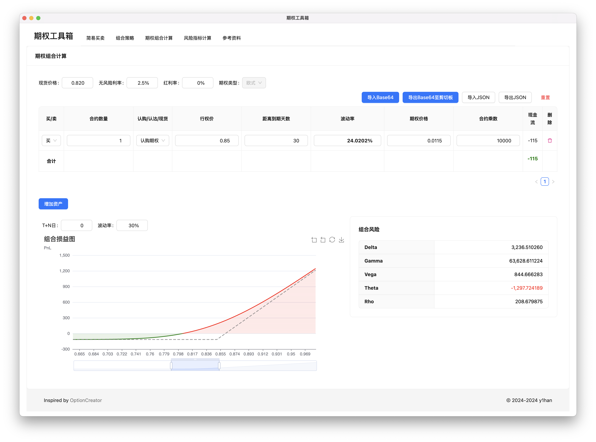

# Option Toolbox 期权工具箱
Inspired by <a href="https://optioncreator.com"> Option Creator </a>

工具箱以OptionCreator为基础模版，针对中国期权市场的情况以及相关的指标进行了一部分的调整，并使用Electron框架进行了包装，使其能够以App形式进行运行。



## 已实现功能

1. 期权组合计算
   - 单标的隐含波动率计算（Brent方法）
   - 组合损益图绘制（可调整日期、波动率）
   - 组合风险指标计算
   - 组合导入导出（JSON、Base64格式）
   - 菜单栏设置了默认组合供选取
   - 支持根据价格/隐含波动率倒推另一个结果（粗体为固定住的参数）
2. 期权风险指标计算
   - 根据各个参数计算结果
   - 支持根据价格/隐含波动率倒推另一个结果（粗体为固定住的参数）


## 快速上手

- 部署相关包
    ```shell
    npm install
  ```
- 快速启动（开发模式）
    ```shell
    npm run start
  ```
- 对应用程序进行打包
    ```shell
    npm run package_win  # Windows (x64架构)
    npm run package_mac  # MacOS (arm64架构)
  ```

- mac系统出现"Option Toolbox.app Is Damaged and Can’t Be Opened. You Should Move It To The Trash"错误
    ```shell
  xattr -c <文件路径>
  ```

## 主要工具
- Electron
- Vue
- Ant Design Vue
- ECharts
- KaTex


## 已知问题

1. mac版本文件过大，需要进行优化
